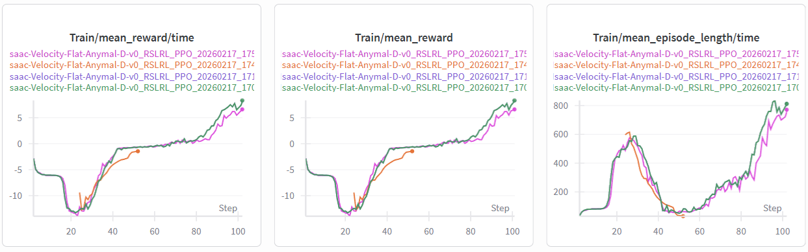

# IsaacLab on Modal



Running IsaacLab 2.0.2 with IsaacSim 4.5.0 on serverless GPUs using Modal and micromamba.

## Overview

This project sets up IsaacLab and IsaacSim on Modal's serverless GPU infrastructure using:
- **IsaacSim 4.5.0**: NVIDIA's robotics simulation platform
- **IsaacLab 2.0.2**: Learning framework for robot learning built on IsaacSim
- **Micromamba**: Fast, lightweight package manager for Python and system dependencies
- **Modal**: Serverless GPU compute platform

## Quick Start

1. **Install dependencies**:
   ```bash
   uv sync
   # or
   pip install modal
   ```

2. **Run the setup**:
   ```bash
   modal run isaaclab_modal.py::main
   ```

3. **Check installation status**:
   ```bash
   modal run isaaclab_modal.py::check_installation
   ```

4. **Train a robot with wandb logging**:
   ```bash
   # Train Anymal-D on rough terrain with wandb
   modal run isaaclab_modal.py::train_robot \
     --task Isaac-Velocity-Rough-Anymal-D-v0 \
     --num-steps 1000 \
     --use-wandb \
     --wandb-project isaaclab-training \
     --wandb-key your_wandb_key_here
   
   # Or train the ant (original task)
   modal run isaaclab_modal.py::train_robot \
     --task Isaac-Ant-v0 \
     --num-steps 1000
   ```

## Available Commands

- `modal run isaaclab_modal.py::main` - Run the test suite and verify installation
- `modal run isaaclab_modal.py::check_installation` - Check if everything is installed correctly
- `modal run isaaclab_modal.py::run_isaaclab_test` - Run a basic IsaacLab test
- `modal run isaaclab_modal.py::train_robot` - Train a robot using RL with wandb support (default: Anymal-D)

## Setup Details

The Modal image (`isaaclab_modal.py`) performs the following steps:

1. **Base Image**: Uses `nvidia/cuda:12.1.0-devel-ubuntu22.04` for CUDA support
2. **Dependencies**: Installs system libraries for graphics, X11, and IsaacSim
3. **IsaacSim**: Downloads and extracts IsaacSim 4.5.0 from NVIDIA's servers
4. **IsaacLab**: Clones IsaacLab 2.0.2 and creates the `_isaac_sim` symbolic link
5. **Installation**: Runs `isaaclab.sh --install` to set up all dependencies

## File Structure

```
.
├── isaaclab_modal.py    # Main Modal configuration and setup
├── train_with_wandb.py  # Custom training script with wandb logging
├── pyproject.toml       # Project dependencies
├── README.md            # This file
└── .venv/               # Virtual environment
```

## Environment Variables

The following environment variables are set automatically:

- `ISAACSIM_PATH=/root/isaacsim` - Path to IsaacSim installation
- `ISAACSIM_PYTHON_EXE=/root/isaacsim/python.sh` - IsaacSim Python executable
- `PYTHONPATH` - Includes IsaacSim and IsaacLab source paths
- `DISPLAY=:0` - For headless rendering
- `OMNI_KIT_ACCEPT_EULA=YES` - Accepts IsaacSim EULA automatically

## Logging with Weights & Biases

The setup includes a **custom training script** (`train_with_wandb.py`) with built-in wandb support.

### Features:
- ✅ Real-time logging of rewards, episode length, and losses
- ✅ Automatic hyperparameter tracking
- ✅ Model checkpoint saving to wandb
- ✅ Support for multiple robots (Anymal-D, Ant, etc.)

### Usage:

1. **Get your wandb API key** from https://wandb.ai/authorize

2. **Run training with wandb**:
   ```bash
   modal run isaaclab_modal.py::train_robot \
     --task Isaac-Velocity-Rough-Anymal-D-v0 \
     --num-steps 1000 \
     --use-wandb \
     --wandb-project isaaclab-training \
     --wandb-key your_wandb_key_here
   ```

3. **View results**: Check your wandb dashboard at https://wandb.ai

### Available Tasks:
- `Isaac-Velocity-Rough-Anymal-D-v0` - Anymal-D quadruped on rough terrain
- `Isaac-Ant-v0` - Classic ant locomotion
- See [IsaacLab tasks](https://isaac-sim.github.io/IsaacLab/main/source/overview/environments.html) for more

## Troubleshooting

### First Run
The first time you run the setup, Modal will:
1. Download IsaacSim (6.7 GB) - takes ~5-10 minutes depending on connection
2. Extract IsaacSim - takes ~5 minutes
3. Clone IsaacLab - takes ~1 minute
4. Install dependencies - takes ~5-10 minutes

Total setup time: ~20-30 minutes for the first run. Subsequent runs use the cached image.

### GPU Requirements
- Minimum: T4 GPU (tested)
- Recommended: L4 or A10G for faster training
- Edit the `gpu="T4"` parameter in `isaaclab_modal.py` to change GPU type

### Common Issues

1. **Download fails**: Check your internet connection and NVIDIA's download URL accessibility
2. **Out of memory**: Use a larger GPU or reduce batch sizes in training scripts
3. **Import errors**: Ensure the symbolic link `_isaac_sim` is created correctly

## References

- [IsaacLab 2.0.2 Documentation](https://isaac-sim.github.io/IsaacLab/v2.0.2/source/setup/installation/binaries_installation.html)
- [IsaacSim 4.5.0 Documentation](https://docs.isaacsim.omniverse.nvidia.com/4.5.0/installation/install_workstation.html)
- [Modal Documentation](https://modal.com/docs)
- [Micromamba Documentation](https://mamba.readthedocs.io/en/latest/user_guide/micromamba.html)

## License

This project uses IsaacSim and IsaacLab which are subject to NVIDIA's license agreements.
